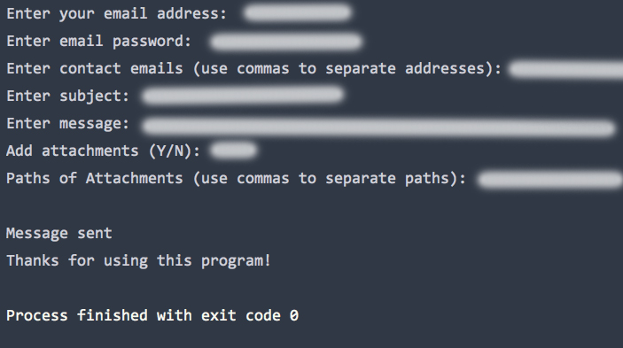

# Emailer Bot
This bot can send messages and attachments with your gmail account.  This script can be a useful add-on to your
other scripts if you need to automate the emailing process. 

## Getting Started
This script is configured to work with your gmail account only.

Remember to configure your gmail settings to allow this bot to access your gmail account.  The link
to configure this setting can be found here: https://myaccount.google.com/lesssecureapps

### Prerequisites
Python 3.6 or later is required.

Required python modules:

    *os
    *smtplib
    *email
  
## Example

