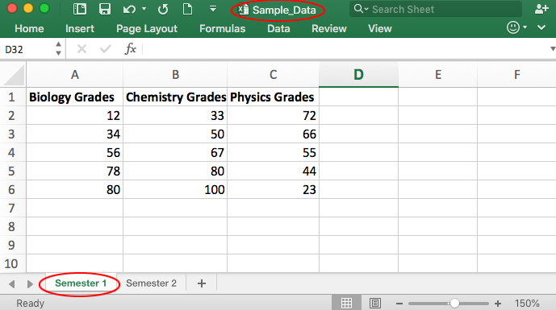
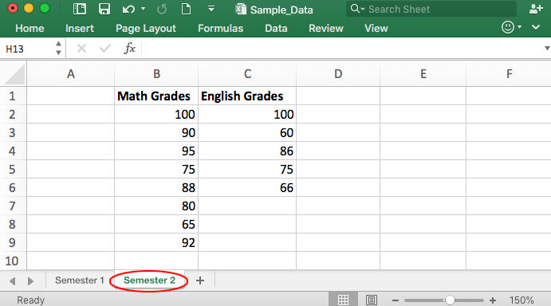
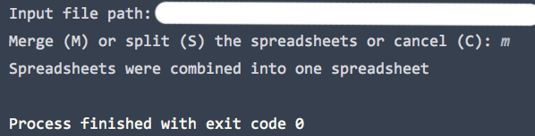
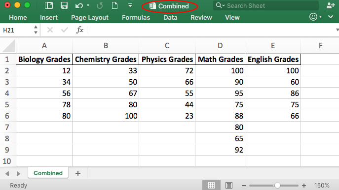
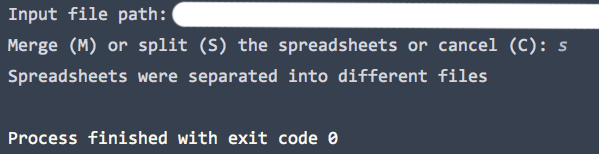
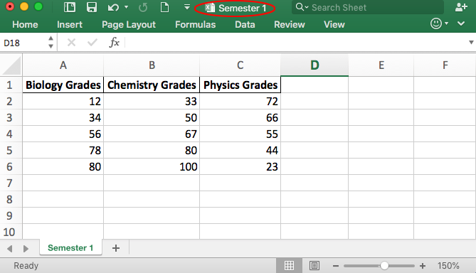
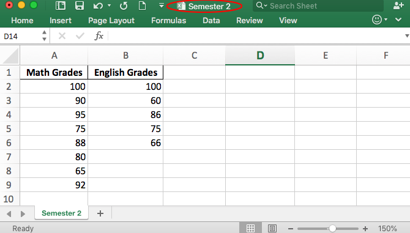

# Excel Combiner & Splitter

This script takes in Excel spreadsheets and either combine the sheets into one sheet or split the sheets into separate Excel files. 

## Features
    *Accepts Excel files in xlsx format
    *Excel file input can contain any number of spreadsheets
    
## Getting Started

The script would ask for the path of the Excel file input (xlsx format).  If the merge (M) option is selected, a Combined.xlsx file would be created with all the sheets combined into 1 sheet.
If the split (S) option is selected, the input Excel file would be split into separate files that are named according to the original sheet name.

### Prerequisites
Python 3.6 or later is required.

Required python modules:

    *functools (standard libary)
    *pandas
    *xlsxWriter 

## Example

    

    

