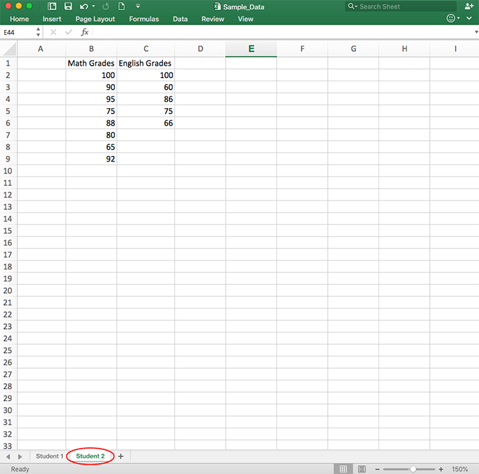
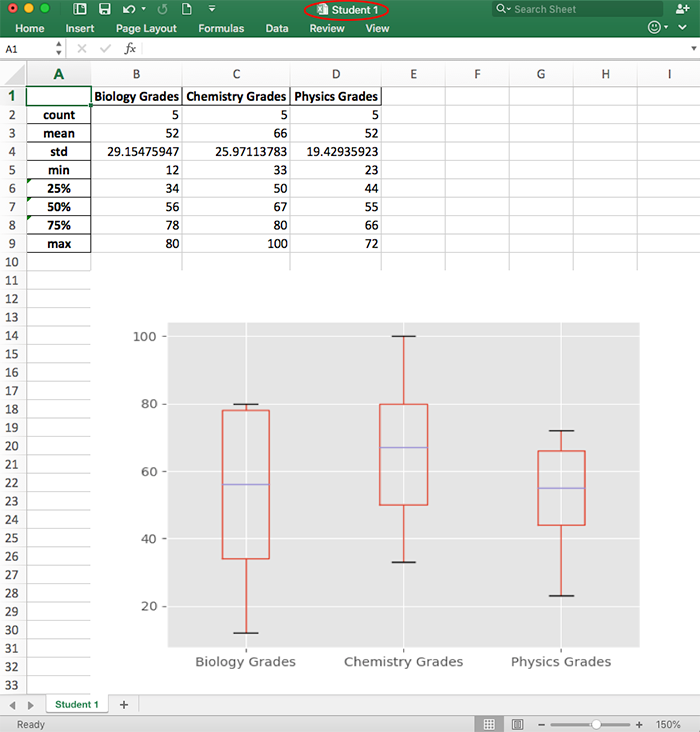
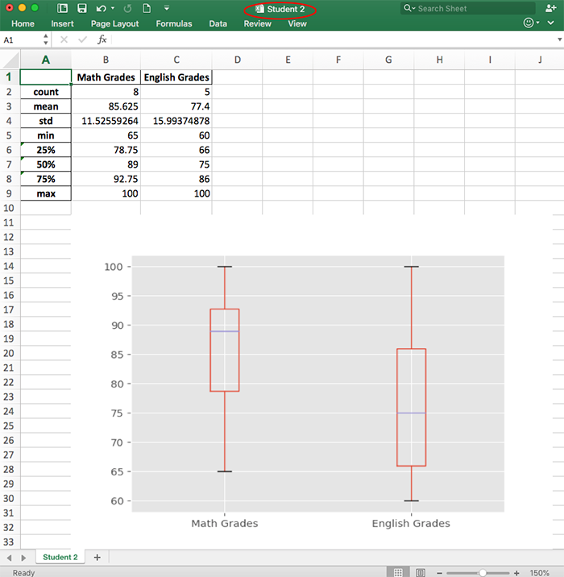

# Excel Grapher

This script takes in Excel data and outputs descriptive statistics and boxplot graphs.

## Features
    *Descriptive statistics and a boxplot would be generated for each worksheet in the workbook
    *A separate Excel file would be returned for each worksheet
    *Great for automating tasks that require information on the spread of data from various data sets
    
## Getting Started

The script would ask for the path of the Excel file (xlsx format).  If the workbook contains multiple worksheets, the script would 
generate separate files for each worksheet.  

### Prerequisites
Python 3.6 or later is required.

Required python modules:

    *io (standard libary)
    *os (standard libary)
    *matplotlib
    *pandas
    *xlsxWriter 

## Example
Sample Data<space><space>
<space><space>
<space><space>

Output Files<space><space>
<space><space>

