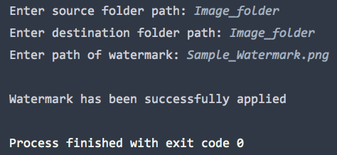

# Image Watermarker Bot

This bot adds a watermark around the center of an image in various formats like jpg and png (pdfs are not supported).
  Further, the bot would apply the watermark to all the images in a source folder.    

## Getting Started
Upon startup, you will be prompted to provide the path of your folder containing your source images and the path of your watermark.  The full path is required if the files are not in the same directory as the python script.
I have included a sample watermark in this directory.  The watermark should have a transparent background.
  If you are planning to apply a watermark to multiple images.  This script does not resize your images so keep in mind the size of your watermark when applying it over multiple images.
  
### Prerequisites
Python 3.6 or later is required.

Required python modules:

    *PIL
    *OS (included in standard library)
    *glob (included in standard library)
  
## Examples

