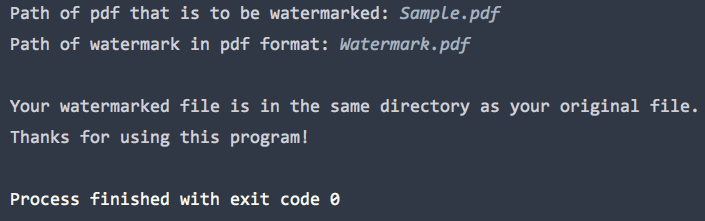

# PDF Watermarker Bot

This bot adds watermark to your pdf files.

## Getting Started
You will be prompted to provide the directory paths of your pdf file and watermark upon startup.  The full path is required if the pdf files are not in the same directory as this script.
I have included a sample watermark in this directory.  The watermark should be in pdf format and have a transparent background.
After running this script, the watermarked file would be in the same directory as your original pdf file.

### Prerequisites
Python 3.6 or later is required.

Required python modules:

    *OS (included in standard library)
    *PyPDF2
  
## Example

