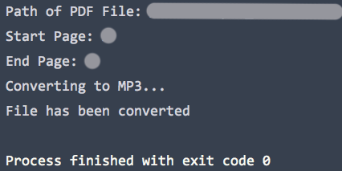

# PDF to MP3 Converter

This script converts PDF files to MP3 files. 

## Features
    *Powered by Google Translate’s text-to-speech API
    *Can select the pages that need to be converted
    *Converts one file at a time
    *Converted file would have a female voice
    
## Getting Started

The script would ask for the path of the PDF file and the start/end page numbers of the pages that would be converted.
  After the conversion, the new MP3 file would have the same name as the original PDF file and be in the same directory as this script.
  Note that the conversion may take a long time if many pages need to be converted.  

### Prerequisites
Python 3.6 or later is required.  As the gtts module uses Google Translate’s text-to-speech API, an internet connection is required.

Required Python modules:

    *os (standard libary)
    *gtts
    *PyPDF2 

## Example

