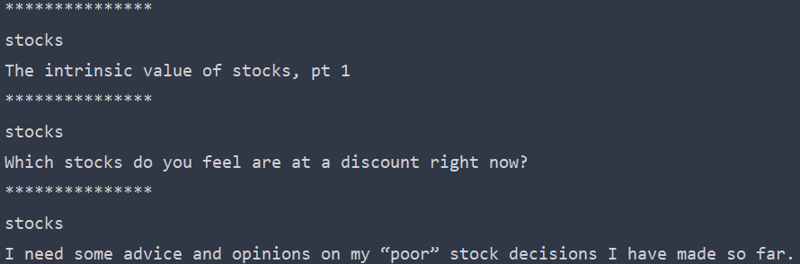

# Reddit Bot

This bot continuously upvotes any new post submissions with the desired keyword.

## Features
    *Powered by the Python Reddit API, Praw
    *Bot can be configured to perform other actions
   
## Getting Started
A reddit account must first be created.  Log into the reddit account then go to https://www.reddit.com/prefs/apps to create an app (ensure "script" is chosen in the option menu).
Input the app information and desired keyword in the python script.  Further instructions are written in the python script.

## Prerequisites
Required python module:
    *praw
  
## Example console output when scanning r/stocks and r/investing for the keyword "stock"

